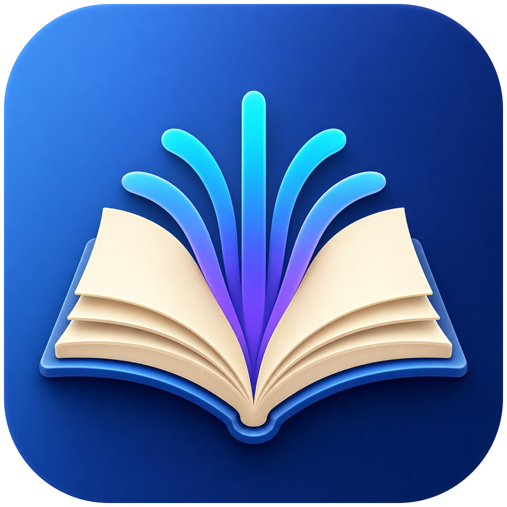
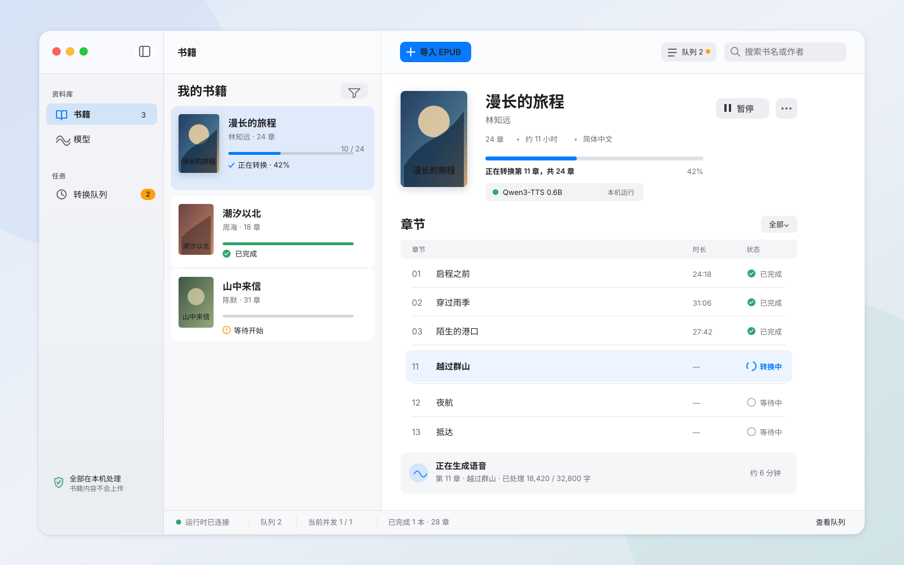

<p align="center">
  
</p>

<h1 align="center">AudiobookMaker</h1>

<p align="center">
  把 EPUB 变成带章节、封面和完整元数据的 M4B 有声书，全程在 Mac 本地完成。
  <br>
  Turn EPUB books into chaptered, metadata-rich M4B audiobooks entirely on your Mac.
</p>

<p align="center">
  <a href="https://github.com/shiye515/AudiobookMaker/releases/latest"></a>
  
  
  
  <a href="LICENSE"></a>
</p>

<p align="center"><strong>离线语音合成 · 单文件 M4B · Apple Silicon 专用</strong></p>



## 为什么选择 AudiobookMaker

- **真正的 M4B 有声书**：导出一个可直接加入 Apple Books 等播放器的 `.m4b` 文件，而不是音频文件压缩包。
- **章节导航、封面与元数据**：把 EPUB 章节写入音频时间线，并保留标题、作者、封面和出版信息。
- **三种本机语音路径**：无需下载的 Apple 系统语音，以及按需下载的 CosyVoice3 与 Qwen3-TTS。
- **Apple Silicon 优化**：本地 AI 模型通过 speech-swift、MLX Swift 与 Metal 运行，并复用模型 session、限制安全并发。
- **可暂停、可恢复**：显示章节转换进度，长篇书籍可暂停后继续处理。
- **隐私优先**：书籍解析、语音合成和 M4B 封装都在本机完成，书籍内容不会上传。

## 下载与使用

1. 前往 [Releases](https://github.com/shiye515/AudiobookMaker/releases/latest) 下载 Apple Silicon 版本。
2. 解压后把 `AudiobookMaker.app` 拖入“应用程序”。
3. 启动应用，导入 EPUB，选择语音模型和音色并开始转换。
4. 转换完成后导出单个 M4B 文件。

### 系统要求

- Apple Silicon Mac（原生 arm64；不支持 Intel Mac 或 Rosetta）
- macOS 26.0 或更高版本
- CosyVoice3/Qwen3-TTS 需要 Metal；Apple 系统语音无需模型下载
- 模型权重不包含在仓库或 App bundle 中。CosyVoice3 约 1.12 GB，Qwen3-TTS（含 tokenizer）约 2.50 GB，安装还需要 staging 与安全余量

升级时，旧版已移除模型的默认设置会回退到 Apple 系统语音。绑定已移除模型的未完成任务会明确要求重新开始；应用不会把旧 checkpoint 静默交给另一种语音继续生成。

## 工作流程

```text
EPUB → 安全解析章节 → 本地语音合成 → 合并音频 → 写入章节/封面/元数据 → M4B
```

CosyVoice3 与 Qwen3-TTS 只在用户明确点击下载后联网。安装器校验固定清单、文件大小和 SHA-256，并把模型原子安装到 App 管理的 Application Support 目录。安装完成后，试听与转换均可断网执行。

## 从源码构建

需要 Apple Silicon Mac、完整 Xcode 26 或兼容版本，以及 Metal Toolchain：

```bash
git clone https://github.com/shiye515/AudiobookMaker.git
cd AudiobookMaker
xcodebuild -downloadComponent MetalToolchain
open AudiobookMaker.xcodeproj
```

无签名 Debug 构建：

```bash
xcodebuild build \
  -project AudiobookMaker.xcodeproj \
  -scheme AudiobookMaker \
  -configuration Debug \
  -destination 'platform=macOS,arch=arm64' \
  ARCHS=arm64 \
  CODE_SIGNING_ALLOWED=NO
```

arm64 Release archive 与产物门禁：

```bash
Tools/archive-apple-silicon.sh
Tools/verify-release-artifacts.sh build/AudiobookMaker-AppleSilicon.xcarchive
```

发布门禁会递归检查所有 Mach-O 代码仅含 arm64，检查链接依赖，并拒绝已移除运行时路径或模型权重。开发、运行时分发、性能基准和验收说明见 [`docs/`](docs/)。

## 隐私与第三方组件

AudiobookMaker 不收集书籍内容或使用数据。仅当用户主动下载 CosyVoice3 或 Qwen3-TTS 时才需要网络连接，详情见[隐私说明](docs/privacy.md)。

应用保留 speech-swift、MLX Swift、Swift Transformers 和外部模型的原始许可证信息，详见[第三方软件声明](docs/third-party-notices.md)与 [SBOM](docs/sbom.json)。

## 参与贡献

欢迎提交 Issue、功能建议和 Pull Request。报告问题时，请附上 macOS 版本、Mac 芯片型号、可复现步骤和已脱敏日志；请勿上传受版权保护的书籍或模型文件。

## License

AudiobookMaker 的原创代码以 [MIT License](LICENSE) 开源。第三方组件及模型仍遵循各自的许可证。
