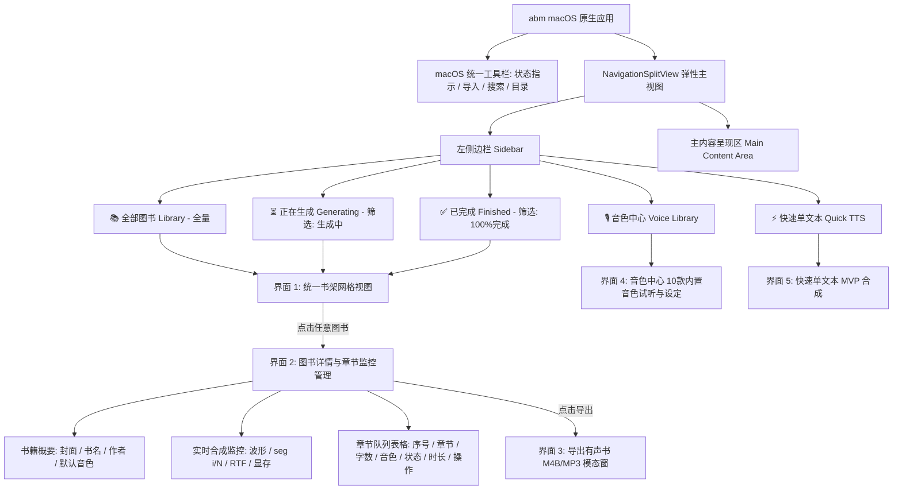
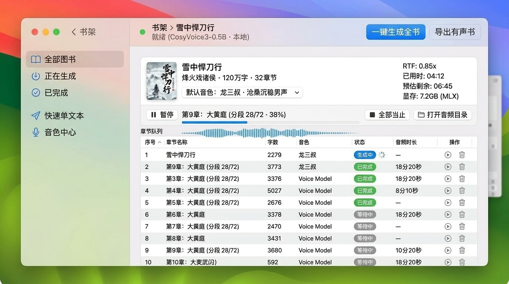
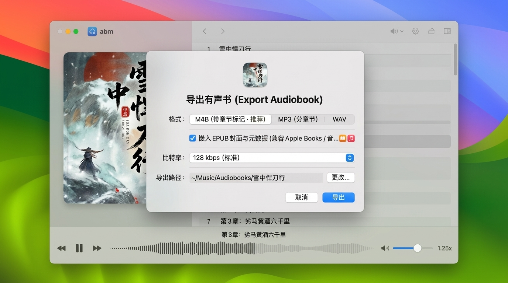

# abm: EPUB 有声书制作应用 — 全界面设计稿与交互规范

> **项目名称**: abm (AudioBook Maker)  
> **设计系统**: macOS 14/15 (Sonoma / Sequoia) 原生 Human Interface Guidelines (HIG)  
> **核心引擎**: CosyVoice3-0.5B (MLX 本地离线推理) + Soniqo speech-swift  
> **文档归档目录**: `docs/EPUB-AUDIOBOOK-UI-DESIGN.md`  
> **配套设计稿资产**: `docs/ui-mockups/`  
> **更新日期**: 2026-09-13 (按最新交互重构：图书点击直通详情复用监控 UI，收敛筛选逻辑)  

---

## 1. 产品背景与设计演进

### 1.1 从单段 MVP 到完整有声书应用
当前项目的 MVP 版本已完成底层核心链路验证：
- **引擎层**: 本地加载 Fun-CosyVoice3-0.5B + CAM++ 说话人编码器，内置 10 款高质量有声书音色（零样本声音克隆）。
- **文本分块**: 基于 `TextChunker` 实现了句末标点切分与长文本分段拼接（~50-120 字/段），杜绝了 speech-swift 框架的长文本遗漏与重复问题。
- **输出与日志**: 原子化生成带时间戳与 runID 的 WAV 文件，自动持久化至 `~/Library/Application Support/abm/audio/`，并具备全链路执行日志。

```
+--------------------------------------------------------------------------+
| 当前 MVP 界面 (验证单文本合成)                                            |
| [初始化模型] ● 就绪 (CosyVoice3-0.5B · 本地)       [打开音频目录] [打开日志目录] |
| 音色: [ 龙婉君 · 细腻柔美女声 v ]                                         |
| +----------------------------------------------------------------------+ |
| | (长文本输入框……)                                                     | |
| +----------------------------------------------------------------------+ |
| [ 合成 ]  最近输出: 20260913-161631-432-15f5b0e5-龙婉君.wav (116.8s)       |
+--------------------------------------------------------------------------+
```


### 1.2 进阶目标：极简、直达的标准 macOS 有声书工坊
为了让体验更加精简高效，舍弃多余的中间层（阅读排版工作区），确立了以**“书架直通章节详情，聚合监控与控制”**为核心的高效交互架构：
1. **书架主页 (统一图书陈列与状态筛选)**:
   - 侧边栏的「全部图书」、「正在生成」、「已完成」仅作为**状态筛选器**，共用同一套高质感图书瀑布流网格，保持视图统一。
   - 统一由顶部工具栏的 `[+ 导入 EPUB]` 按钮触发电子书导入。
2. **图书详情页 (直通常见任务，复用监控与章节队列表格)**:
   - 点击书架中的任意图书，**直接进入图书详情与章节生成管理界面**。
   - 顶部提供全书概览与全书默认音色配置，中间嵌入实时合成进度与动态音频波形看板，下方平铺完整的章节队列表格（字数、音色、状态、音频时长、试听/重试）。
3. **有声书播放与导出交付**:
   - 底部常驻原生音频波形控制器，支持导出带有完整章节标记的单文件 **M4B**（兼容 Apple Books / 播客 App）或按章节分发的 **MP3/WAV**。
4. **平滑保留 MVP 快速合成**:
   - 侧边栏专属「⚡️ 快速单文本」入口，完整保留零散文本快速测试与发音试听。

---

## 2. 信息架构与导航拓扑 (Information Architecture)

应用采用 macOS 标准的 `NavigationSplitView` 弹性架构，支持窗体自由缩放（推荐默认尺寸 `1280 × 840`，最小尺寸 `1080 × 720`）。



---

## 3. 各界面详细设计规范与高保真设计图

### 界面 1: 书架与图书导入 (Library & Import View)

书架界面是用户进入应用的核心门户。**「全部图书」、「正在生成」与「已完成」是侧边栏的三个筛选状态，共用这同一套清爽纯净的图书卡片网格界面。**


#### 3.1.1 界面布局与组件定义
- **macOS 统一工具栏 (Unified Toolbar)**:
  - 左侧: 窗口红黄绿交通灯按钮；边栏收起/展开按钮（`SidebarToggle`）。
  - 中间: `书架 - abm`，紧随引擎状态指示灯 `● 就绪 (CosyVoice3-0.5B · 本地)`。
  - 右侧: 显目的蓝色主按钮 **`[+ 导入 EPUB]`**（快捷键 `⌘N`）、全局书籍搜索框。
- **左侧导航栏 (Sidebar)**:
  - 系统半透明材质（`.sidebar` Vibrancy），提供视图分类与筛选：
    - `📚 全部图书 (Library)`: 展示所有已导入书籍。
    - `⏳ 正在生成 (Generating)`: 过滤仅展示有章节正在后台合成的书籍（附带活跃任务数 Badge 如 `24`）。
    - `✅ 已完成 (Finished)`: 过滤仅展示所有章节已全部生成完成的书籍。
    - `⚡️ 快速单文本 (Quick TTS)`: MVP 单文本即时合成模式。
    - `🎙️ 音色中心 (Voices)`: 10 款内置音色试听与默认偏好配置。
- **主工作区 (Main Content)**:
  - **纯净图书网格瀑布流 (Clean Book Grid)**:
    - 绝不放置多余的底部上传框，完全由图书卡片铺展，留白优雅。
    - **封面图**: 自动从 EPUB 压缩包中解压并渲染 `cover.jpg/png`，带 8pt 圆角和环境软阴影。
    - **书籍元数据**: 书名（SF Pro Display SemiBold）、作者、总字数（如 `刘慈欣 · 53 万字`）。
    - **状态进度条**:
      - 生成中书籍: 蓝色进度条展示已完成比例（如 `12/32 章节 · 42% 已生成`）。
      - 已完成书籍: 绿色文字标示 `已就绪 · 18小时`。
      - 未开始书籍: 浅灰文字标示 `待生成 · 预估 6小时`。

#### 3.1.2 关键交互动作
1. **导入书籍**: 点击工具栏右上角的 `+ 导入 EPUB` 唤起系统原生 `NSOpenPanel` 选取 `.epub` 文件（同时支持直接将 `.epub` 文件拖入窗口快速导入）。
2. **进入图书详情**: **鼠标左键单击任意图书卡片，立即无缝下钻进入「界面 2: 图书详情与章节监控管理」**。

---

### 界面 2: 图书详情与章节管理 (Book Detail & Chapter Queue View)

**这是点击书架中图书后直接进入的核心操作页。它直接复用并整合了批量生成监控与章节队列表格的全部 UI 能力，省去了冗余的中间阅读层。**



#### 3.2.1 界面布局与组件定义
- **顶部导航与工具条**:
  - 左侧: 返回书架按钮 **`< 书架`**、当前书籍路径面包屑（如 `书架 > 雪中悍刀行`）、引擎状态指示 `● 就绪 (CosyVoice3-0.5B · 本地)`。
  - 右侧: 两个核心全局行动点：
    - `[一键生成全书]` (Accent 蓝色主按钮，若已在生成则变为 `[⏸ 暂停全部]`)。
    - `[导出有声书]` (次级按钮，触发导出 Sheet)。
- **书籍概览与监控看板 (Header & Synthesis Monitor Card)**:
  - **左侧书籍基础信息**:
    - 封面缩略图、书名（`雪中悍刀行`）、作者与规格（`烽火戏诸侯 · 120万字 · 32章节`）。
    - **全书默认音色下拉框**: `默认音色: [ 龙三叔 · 沧桑沉稳男声 v ]`，一处修改全局生效。
  - **右侧硬件与性能遥测 (Telemetry)**:
    - `RTF: 0.85x`（实时因数，反映当前机器每秒可生成语音秒数）。
    - `已用时: 04:12` / `预估剩余: 06:45`（ETA 精准计算）。
    - `显存: 7.2GB (MLX)`（实时监控 Apple Silicon 共享内存状态）。
  - **当前活跃章节状态条**:
    - 活跃信息: `第9章: 大黄庭 (分段 28/72 · 38%)`。
    - 动态音频波形指示器（推理过程中随音频分片实时跳动）。
    - 快捷按钮组: `[⏸ 暂停]`、`[⏹ 全部停止]`、`[📁 打开音频目录]`。
- **章节队列表格 (Chapter Queue Table)**:
  - 标准 macOS TableView 结构，清晰呈现整本书的每一章节状态：
    - `序号`: 章节索引顺序（1, 2, 3...）。
    - `章节名称`: 提取自 EPUB 目录树的标题（如 `第9章: 大黄庭`）。
    - `字数`: 章节纯文本字数（如 `3773`）。
    - `音色`: 章节专属音色（默认继承全书音色，亦支持单章单独覆盖）。
    - `状态`: 
      - `生成中`: 蓝色 Badge 配微型旋转 Spinner。
      - `已完成`: 绿色圆角 Badge。
      - `等待中`: 浅灰圆角 Badge。
    - `音频时长`: 已生成章节展示实际音频长度（如 `18分20秒`），未生成展示 `—`。
    - `操作`: 快速试听播放按钮 `▶`、重新生成按钮、删除/重置按钮 `🗑`。

---

### 界面 3: 有声书播放器与导出中心 (Audiobook Player & Export Center)

有声书全部或部分章节生成完毕后，用户可在此进行沉浸式试听并导出成标准的有声书文件。



#### 3.3.1 底部常驻播放器 (Persistent Player)
- **波形进度条**: 呈现整章音频振幅波形，支持拖拽定位（Scrubber）。
- **走带控制**: 快退 15 秒、播放/暂停、快进 30 秒。
- **播放属性**: 当前章节名称、时间戳（`05:18 / 16:30`）、音量滑块、播放倍速（`1.0x | 1.25x | 1.5x | 2.0x`）。

#### 3.3.2 导出有声书弹窗 (Export Audiobook Sheet)
在工具栏或操作区点击「导出有声书」，弹出系统原生模态 Sheet：
1. **导出格式分段选择器 (Segmented Picker)**:
   - `M4B (带章节标记 · 推荐)`: 行业标准单文件有声书格式，内嵌章节列表、章节名与时间标记，直接无缝导入 Apple Books / 音乐 / 播客 App 或车载系统。
   - `MP3 (分章节)`: 按章节拆分为独立 MP3 音频文件，自动写入 ID3v2 标题与序号。
   - `WAV`: 导出原始 24kHz 16-bit PCM 无损音频。
2. **元数据集成**:
   - `[✔] 嵌入 EPUB 封面与元数据 (兼容 Apple Books / 音乐)`。
3. **音频品质/码率 (Bitrate)**:
   - 下拉选择 `96 kbps` / `128 kbps (推荐标准)` / `192 kbps`。
4. **输出路径**:
   - 默认指定至 `~/Music/Audiobooks/[书名]/`，附带 `[更改...]` 访达选择器。
5. **执行控制**:
   - `[取消]` 与 Accent 蓝色 `[导出]` 按钮，导出时展示进度环，完成后支持在访达中高亮定位。

---

### 界面 4: 音色中心与角色试听管理 (Voice Library & Narrator Profiles)

用于集中管理与试听 CosyVoice3 内置的 10 款零样本克隆有声书音色。


#### 3.4.1 界面布局与组件定义
- **顶部标签筛选器 (Filter Bar)**:
  - 分类 Pills: `全部` | `男声` | `女声` | `评书评话` | `情感言情`，右侧配有搜索框。
- **音色卡片陈列 (Voice Card Grid)**:
  - 针对内置音色（龙婉君、龙三叔、龙妙、龙老伯、龙楠、龙秀、龙月、龙远、龙逸尘、龙老姨）提供拟人化卡片：
    - **角色形象**: 风格鲜明的拟人头像。
    - **特质与适用题材**:
      - `龙婉君 · 细腻柔美女声`: 适合言情、情感、现代都市。
      - `龙三叔 · 沧桑沉稳男声`: 适合武侠、历史、传统大部头评书。
      - `龙妙 · 灵动少女音`: 适合轻小说、动漫改编、青春题材。
      - `龙老伯 · 沉郁长者音`: 适合悬疑推理、鬼狐演义、长篇纪实。
    - **即时试听播放器**: `[试听 10s ▶ |||||||]`，直接播放打包进 Target 的 mp3 样本，0 延迟毫秒级出声。
    - **全局首选项**: `[设为默认旁白]` 按钮，设定后作为新导入书籍的默认音色。

---

### 界面 5: 快速单文本合成 (Quick TTS / MVP 保留)

侧边栏保留 `⚡️ 快速单文本` 入口，无缝承载原 MVP 的极简界面能力：
- 支持快速粘贴短文本试听单句发音。
- 保留音色下拉框、文本输入框、合成按钮，合成后 WAV 落盘并记录日志，提供 `[打开音频目录]` 与 `[打开日志目录]` 快捷按钮。

---

## 4. 技术架构与工程落地规范

```
abm/
├── App/
│   ├── abmApp.swift                 # 应用生命周期与全局 Commands 快捷键 (⌘N 导入, ⌘E 导出)
│   └── AppNavigationState.swift     # 侧边栏筛选路由状态 (All / Generating / Finished / QuickTTS / Voices)
├── Models/
│   ├── BookProject.swift            # 书籍项目模型 (id, title, author, coverURL, chapters, defaultVoice)
│   ├── Chapter.swift                # 章节模型 (id, title, wordCount, voiceId, status, duration, audioURL)
│   └── ExportPreset.swift           # M4B / MP3 / WAV 导出配置
├── Services/
│   ├── EPUBParser/                  # EPUB 解析器 (提取 toc.ncx / nav.xhtml, 文本清洗)
│   ├── BatchQueueManager.swift      # 批量串行合成队列 (Actor 严格隔离，保护 MLX 线程安全)
│   └── AudioM4BExporter.swift       # AVAssetWriter / AAC 编码与 Chapter Atom 时间戳写入
├── Views/
│   ├── MainSplitView.swift          # 根 NavigationSplitView
│   ├── Sidebar/
│   │   └── AppSidebar.swift         # 左侧系统边栏 (带任务徽标与筛选路由)
│   ├── Library/
│   │   ├── LibraryGridView.swift    # 纯净图书网格 (由当前 Filter 驱动过滤数据)
│   │   └── BookCardView.swift       # 单本图书卡片 (封面, 标题, 进度条)
│   ├── BookDetail/
│   │   ├── BookDetailView.swift     # 图书详情主页 (点击卡片直达)
│   │   ├── BookHeaderCardView.swift # 书籍信息头部 + 默认音色 + 性能指标
│   │   ├── ActiveSynthesisCard.swift# 实时波形与 seg i/N 监控
│   │   └── ChapterQueueTable.swift  # 章节队列表格
│   ├── Player/
│   │   ├── PersistentPlayerBar.swift# 底部常驻波形播放条
│   │   └── ExportSheetView.swift    # M4B/MP3 导出 Sheet 模态窗
│   └── VoiceCenter/
│       └── VoiceLibraryView.swift   # 音色中心 10 款声音卡片流
```

---

## 5. 设计资产清单 (已全部归档至 `docs/ui-mockups/`)

| 文件名 | 对应界面 | 描述 |
|---|---|---|
| `docs/ui-mockups/00-mvp-current.png` | 当前 MVP 界面 | 用户提供的当前单文本合成基线实测截图 |
| `docs/ui-mockups/01-library-and-import.jpg` | 界面 1: 书架与图书导入 | 统一网格陈列（全部/正在生成/已完成筛选共用），顶部 `+ 导入 EPUB` |
| `docs/ui-mockups/02-book-detail-queue.jpg` | 界面 2: 图书详情与章节监控 | **点击图书直达**（复用监控与队列表格，含书籍头部、波形看板与章节表） |
| `docs/ui-mockups/03-player-and-export.jpg` | 界面 3: 播放器与导出中心 | 常驻有声书波形播放条 + M4B/MP3 原生导出模态窗 |
| `docs/ui-mockups/04-voice-library.jpg` | 界面 4: 音色中心 | 10 款内置音色拟人卡片 + 10s 快速试听 + 标签筛选 |
